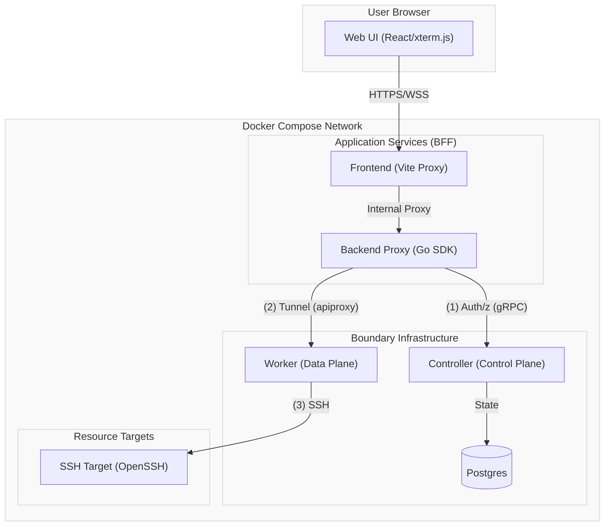
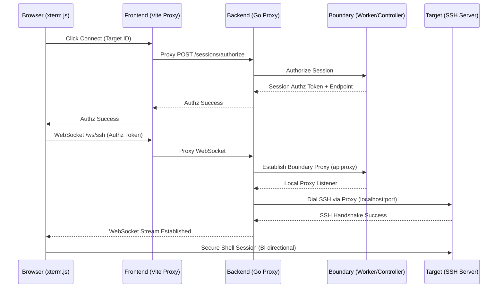

# Comet Boundary Prototype

A web-based client for [HashiCorp Boundary](https://www.boundaryproject.io/) designed for restricted "Comet" environments. Enables secure SSH access directly from the browser without requiring native thick clients.

> [!CAUTION]
> **SECURITY WARNING: DEMO MODE ONLY**
> This project is a **technical prototype** and is strictly intended for demonstration purposes. It contains several architectural and security trade-offs (such as disabled host key verification and shared static credentials) designed for ease of setup in a development environment. 
> 
> **DO NOT use this in production or with sensitive data.** For a detailed breakdown of current deficiencies and the security roadmap, see [CONTRIBUTING.md](./CONTRIBUTING.md).

## Architecture (Slice 1: SSH)

The system is split into a **Control Plane** (identity & authorization) and a **Data Plane** (secure traffic proxying). Since browsers cannot speak Boundary's native protocols, the Go Backend acts as a **Trusted Intermediary**.

### Component Overview


### Communication Planes
1.  **Control Plane (BFF -> Controller):** The Backend uses the Boundary SDK to authenticate users and authorize sessions.
2.  **Data Plane (BFF -> Worker):** Once authorized, the Backend establishes a secure tunnel to the Worker using `apiproxy` and pipes the resulting SSH stream to the browser via WebSockets.

### Connection Flow


- **Backend:** Go (Chi) + Boundary SDK. Bridges Boundary TCP sessions to WebSockets.
- **Frontend:** React + Tailwind CSS + xterm.js.
- **Proxying:** Uses Boundary's `apiproxy` to establish identity-aware tunnels.
- **Auto-Discovery:** The setup script extracts dynamic credentials from Docker logs and injects them into the environment.

## Prerequisites
Before running the demo, ensure you have:
1. **macOS** (The setup scripts are currently optimized for macOS).
2. **Homebrew** (`brew`) installed.
3. **Docker** (Docker Desktop or OrbStack) installed and running.

## One-Button Demo Replay
The fastest way to establish a working demo environment is using the provided Makefile. The process is fully "hermetic" and will verify/install missing system dependencies (like `jq`, `go`, and `node`) via Homebrew automatically.

```bash
make replay
```

This command performs the following sequence:
1.  **Clean:** Wipes all Docker volumes and logs.
2.  **Dependencies (`deps`):** Runs `./scripts/00_check-deps.sh` to ensure `brew`, `jq`, `go`, `node`, and Docker are available.
3.  **Infrastructure & Setup:**
    *   Starts core infrastructure (Postgres, Boundary, SSH Target).
    *   Runs `./scripts/01_setup-boundary.sh` to initialize Boundary and generate credentials.
4.  **Start:** Launches the Backend and Frontend services **inside Docker** using the generated credentials.
5.  **Verify:** Executes `./scripts/02_verify-setup.sh` which validates Docker healthchecks and runs backend unit tests.

## Technical Details
- **SSH Credentials:** The demo is hardcoded to connect to the target as `boundary-user` with password `password`.
- **UI Login:** Pre-filled automatically via Vite environment variables. If fields are empty, check `client/.env.local`.
- **Boundary API:** Accessible at [http://localhost:9200](http://localhost:9200).

## Roadmap
- **Slice 2:** RDP integration via Apache Guacamole (`guacd`).
- **Identity:** Transition from password injection to SAML/OIDC/SSO.
- **Discovery:** Implement a backend target catalog (Database/Vault KV).

See `CONTRIBUTING.md` for detailed technical debt and implementation notes.
