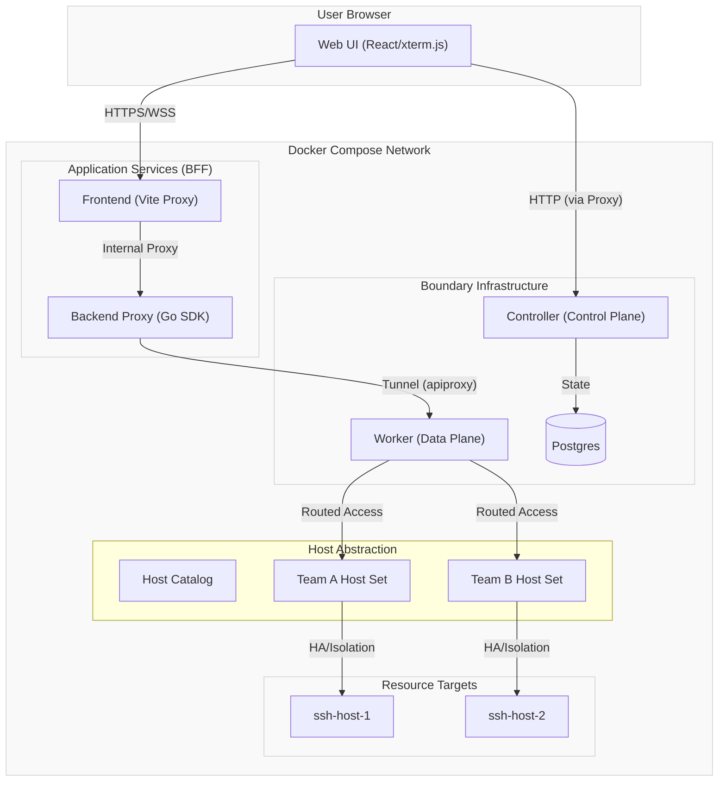
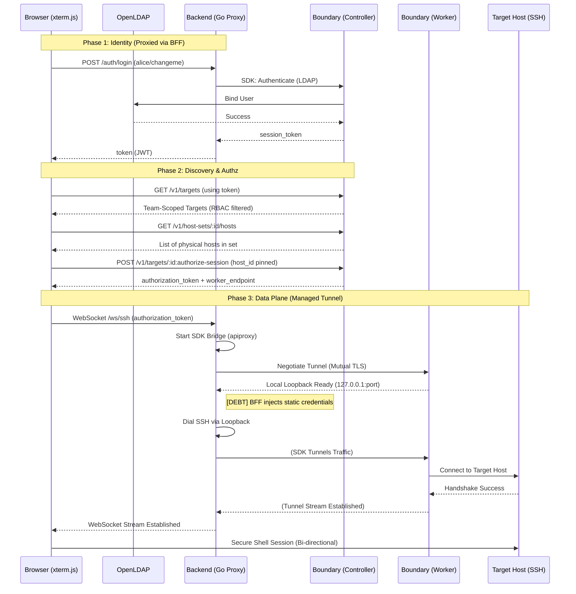

# Architecture & Deep Dive

This document contains the detailed architectural diagrams, connection flows, and scaling considerations for Comet Boundary.

## Architecture (Slice 1: SSH)

The system is split into a **Control Plane** (identity & authorization) and a **Data Plane** (secure traffic proxying). Since browsers cannot speak Boundary's native protocols, the Go Backend acts as a **Trusted Intermediary**.

### Component Overview

### Communication Planes
1.  **Identity & Control Plane (Browser -> Backend/Controller):** 
    *   **Login:** The Browser sends LDAP or Password credentials to the Backend's `/auth/login` endpoint. The Backend uses the Boundary Go SDK to exchange these for a Boundary `token`.
    *   **Discovery:** Once logged in, the Browser uses the `token` to call the Boundary Controller directly (via Vite proxy) to fetch `GET /v1/targets`. This leverages Boundary's RBAC to show only authorized targets.
    *   **Authorization:** The Browser calls `POST /v1/targets/:id:authorize-session` directly against the Controller to receive a short-lived `authorization_token`.
2.  **Data Plane (BFF -> Worker):** The Browser establishes a WebSocket to the Backend, passing the `authorization_token`. The Backend uses `apiproxy` to create a secure tunnel to the Boundary Worker and pipes the SSH stream.

### Connection Flow

## Scaling Considerations

Each SSH session spawns an isolated `boundary connect` subprocess. There is no hard-coded concurrency limit — the practical ceiling is determined by OS and container resources:

| Resource | Default Limit | Estimated Sessions | Notes |
|---|---|---|---|
| **File descriptors** | 1024 (soft) | ~250 per container | Each session uses ~4 FDs (subprocess pipes + SSH conn + WebSocket). Raise with `ulimit -n 65535` for ~16k theoretical. |
| **Memory** | 1 GB container | ~30–60 per container | Each `boundary connect` process consumes ~15–30 MB RSS. |
| **OS processes** | ~30k (`ulimit -u`) | Not the bottleneck | Memory and FDs are exhausted well before the process limit. |
| **Boundary Worker** | Varies | Depends on worker config | The Worker has its own session capacity; consult Boundary docs. |

**Horizontal scaling:** The BFF is stateless — sessions are pinned to individual subprocesses, not to shared in-process state. Deploy multiple backend replicas behind a load balancer (sticky sessions not required for new connections) to scale linearly.

## Known Limitations — Hermetic VM Exposure

When running the demo on a hermetic (headless) VM and exposing ports via a tunnel service (e.g. Traefik, Cloudflare Tunnel), be aware of the following:

### Tunnel Basic Auth breaks SPA Fetch API calls
Most tunnel services authenticate external access by embedding HTTP Basic Auth credentials in the URL. This works for simple page serving but **breaks any Single-Page Application that uses the Fetch API**. The Boundary Admin UI (port 9200) is an Ember.js SPA and will show "ERROR" when accessed through a Basic Auth tunnel. The Comet Boundary frontend (port 5173) works through tunnels because it uses Vite's server-side proxy for API calls.

### Vite host allowlisting
Vite 6+ blocks requests from unrecognized hostnames. When exposing the frontend via a tunnel, set `server.allowedHosts: true` in `client/vite.config.ts`.
