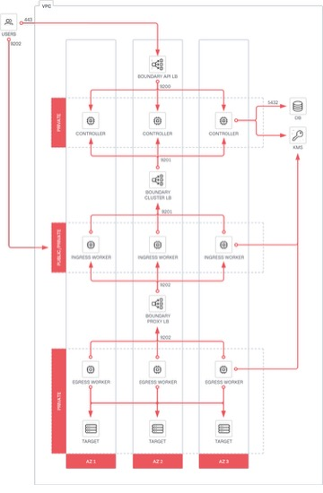
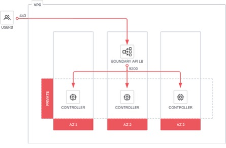
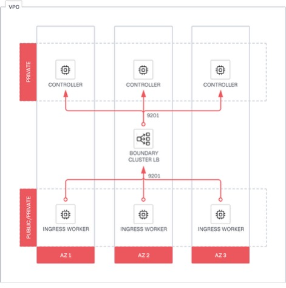
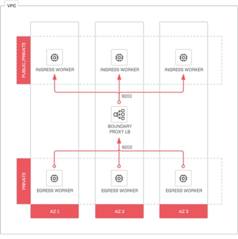

recording data is stored locally within each region
-- -- -- -- **Contents**

- 1 Introduction 4.1 Why use Hashi Corp Validated Designs?

- 1.2 Audience

- 1.3 Supported versions

- 1.4 Language and definitions

- 1.5 Organizational requirements

- 2 Architecture 5.1 Recommended deployment architecture

- 2.2 Controllers

- 2.3 Database
- 2.4 Workers

- 2.5 Key management service

- 2.6 Transport layer security

- 2.6.1 Client-to-controller TLS

- 2.6.2 Client-to-worker TLS

- 2.6.3 Worker-to-upstream TLS

- 2.7 Load balancing

- 3 Detailed design 10.1 Sizing

- 3.1.1 Hardware considerations

- 3.2 Networking

- 3.2.1 Network connectivity

- 3.3 Storage

- 3.4 KMS
- 3.5 Traffic encryption

- 3.6 Load balancing

- 3.6.1 Client-to-controller

- 3.6.2 Worker-to-controller

- 3.6.3 Worker-to-worker (multi-hop sessions)

- 3.7 Monitoring

- 3.7.1 Logs.7.2 Metrics

- 3.8 Failure considerations

- 3.8.1 Controllers

- 3.8.2 Workers

- 3.8.3 Availability zone failures

**4 Deploying Boundary Enterprise using Terraform 22**

4.1 Platform-specific guidance

4.1.1 Deployment on AWS EC2 Hashi Corp Provides official HVD Modules to deploy

Boundary Enterprise controllers and workers on AWS EC2.Before deploy-

ment, deploy the prerequisite infrastructure in AWS as below.1) A functional

VPC with the required subnets 24

4.1.2 Deployment on Azure VMs Hashi Corp provides official HVD Modules to de-

ploy Boundary Enterprise controllers and workers on Azure VMs.Before de-

ployment, deploy the prerequisite infrastructure in Azure.1) An Azure re-

source group 24

4.1.3 Deployment on GCP GCEHashi Corp provides official HVD Modules to deploy

Boundary Enterprise controllers and workers on GCP GCE.Before deploy-

ment, deploy the prerequisite infrastructure in GCP.1) A function VPC with a

public and private subnet 24

4.2 Deployment sequence overview

4.3 Preparation

4.3.1 Create the certificate files

4.3.2 Obtain the Boundary enterprise license file

4.3.3 Download and install the Boundary command-line tool

4.3.4 Download and install the Terraform command-line tool

4.3.5 Download the Terraform module(s)

4.3.6 Configure cloud credentials

4.4 Installation

4.4.1 Initialize Terraform

4.4.2 Configure variables for deployment

4.4.3 Create and apply Terraform plan

4.4.4 Validate installation

4.4.5 Bootstrapping Boundary Enterprise

4.4.6 Install Boundary workers

**5 Deploying Boundary Enterprise 31**

5.1 Overview

5.2 Prepare

5.2.1 License
5.2.2 Servers

5.2.3 Load balancer

5.2.4 PostgreSQL

5.2.5 Storage for session recording

5.3 Boundary Enterprise controller configuration

5.3.1 TLS
5.3.2 KMS for controllers

5.3.3 Prepare controller configuration to initialize a PostgreSQL database

5.3.4 Prepare Boundary Enterprise controller configuration

5.3.5 Initialize a PostgreSQL database

5.3.6 Starting Boundary Enterprise controller service

5.4 Boundary Enterprise ingress workers configuration

5.4.1 KMS for ingress workers

5.4.2 Prepare ingress workers configuration

5.4.3 Starting Boundary Enterprise ingress worker service

5.5 Boundary Enterprise egress workers configuration

5.5.1 KMS for egress workers

5.5.2 Prepare egress workers configuration

5.5.3 Starting Boundary Enterprise egress worker service

5.6 Next steps

**1 Introduction**

**1.1 Why use Hashi Corp Validated Designs?**

Hashi Corp Validated Designs (HVD) provide practitioners with opinionated guidance for achieving production-grade deployments of Boundary Enterprise. These designs are purpose-built for delivering foundational Boundary Enterprise use cases, with a baseline level of architectural and operational maturity. They draw on the field experiences of Solutions Engineers and Solutions Architects working with Boundary Enterprise customers.

This Solution Design Guide provides customers with access to an opinionated reference architecture, including key design decisions and the rationale behind them. Where applicable, the guide identifies modular design components that customers can adjust to align with organizational and/or regulatory requirements without compromising the overall integrity of the implementation. For customers deploying Boundary Enterprise to the cloud, the guide also includes Terraform modules to automate large portions of the infrastructure provisioning and software installation.

**1.2 Audience**

This document is primarily for practitioners (including platform, networking, identity, and information security teams) looking to deploy Boundary Enterprise clusters on-premises or in cloud infrastructure. After using the Solution Design Guide to deploy your Boundary Enterprise infrastructure, operators should refer to Boundary: Operating Guide for Adoption. Using this Operating Guide, Boundary Enterprise operators learn how to integrate with identity providers, configure secure user access, centralize credential management, and more.

**1.3 Supported versions**

This version of the guide relates to Boundary Enterprise 0.17.x+ent.

**1.4 Language and definitions**

This documentation intentionally uses technology agnostic terminology, however there are some terms which do not translate between the cloud providers. The following are the definitions of terms this document uses.

| Term | Definition |
| :--- | :--- |
| **Region** | A physical location in a distinct geographic area containing one or more availability zones (AZ). |
| **Availability zone (AZ)** | An availability zone (AZ) is a single network failure domain that hosts part or all of a Boundary Enterprise cluster. Examples of availability zones include: an individual datacenter |
| **Public subnet** | A network accessible by users. |
| **Private subnet** | A network used by applications and services, but not directly accessible by users. |

**1.5 Organizational requirements**

We expect a single team, often referred to as the Platform Team, to handle the tasks in this guide. However, a successful Boundary Enterprise deployment requires collaboration across multiple organizational functions. The Platform Team needs to work with other teams, such as networking or security for tasks such as IP allocation or certificate management. If hosting infrastructure on a public cloud, consolidate these responsibilities within a unified cloud team. The platform team should thoroughly review this Solution Design Guide to identify any teams they may rely on or need approval from for key deployment tasks. It is essential to designate a project lead to oversee the deployment process and ensure clear communication and coordination with all relevant teams and functions.

**2 Architecture**

**2.1 Recommended deployment architecture**

This section explores the recommended Boundary Enterprise architecture, which provides a highly available, scalable, and secure deployment suitable for production workloads.

The primary components that make up a Boundary Enterprise cluster are:

• Controller nodes

• Worker nodes

• Load balancer

• PostgreSQL database

• KMS (Key management service)

The following diagram shows the recommended architecture for deploying Boundary Enterprise within a single region



**Figure 1:** Boundary Single Region Deployment


**2.2 Controllers**

A minimum deployment consists of three controllers in three separate private subnets distributed across three availability zones to ensure high availability. Configure the controllers to run in a faulttolerant setup, such as an auto-scaling group for a self-healing environment. Users authenticate with the controllers when using Boundary Enterprise. We recommend exposing the controller API and UI to your users through a layer 4 load balancer. See load balancing section for more information.

**2.3 Database**

Controllers are stateless, and manage all configuration through an external PostgreSQL database. We recommend configuring the PostgreSQL database for high availability. Please refer to the PostgreSQL high availability, load balancing, and replication documentation. If you use a managed service, refer to your provider's PostgreSQL high availability documentation.

**2.4 Workers**

A minimum deployment consists of at least three workers across different availability zones within each network boundary to ensure high availability. In environments which restrict inbound connections, deploy both ingress and egress workers to enable multi-hop session proxying, which only requires outbound connectivity. Please refer to the recommended architecture for more details.

**2.5 Key management service**

Boundary controllers use KMS keys to encrypt data at rest and in transit. Before the Boundary worker can proxy user sessions to targets, it must authenticate and register with the Boundary control plane. We recommend using a KMS-led authorization and authentication flow to auto-register the worker. This method requires the controller and worker to share a KMS key to authenticate the worker with the controller. We recommend using Vault's Transit secret engine for key management. If you use a managed service, refer to your provider's key management documentation for guidance.

**2.6 Transport layer security**

**2.6.1 Client-to-controller TLS**

We recommend configuring the TLS (with a public certificate, private key, and certificate authority bundle from a trusted certificate authority) on the Boundary controller nodes. Configure the load balancer to pass through TLS connections to controller nodes. Do not manage the TLS certificate on the load balancer. Terminating TLS connections at the controller nodes offers enhanced security by ensuring that a client request remains encrypted end-to-end. This reduces the attack surface for potential eavesdropping or data tampering.

**2.6.2 Client-to-worker TLS**

Workers do not require any configuration for their client-facing listeners. Instead, they create the

TLS configuration dynamically via Server Name Indication during session authorization, and the session is then mutually authenticated.

**2.6.3 Worker-to-upstream TLS**

Workers establish TLS connections to upstreams (controllers or other workers) dynamically during registration. For more information, refer to this document.

**2.7 Load balancing**

The control plane components of Boundary's architecture benefit from using load balancers. Here are the three scenarios:

• Client-to-controller

• Worker-to-controller

• Worker-to-worker (multi-hop sessions)

The load balancers help secure Boundary's components and increase reliability and stability.

For load balancing from clients to workers, for example when clients initiate sessions to a Boundary Enterprise target, the Boundary control plane manages the distribution of sessions amongst available workers. As such, Boundary Enterprise workers do not require any load balancing.

The design of this architecture requires the use of layer 4 or 7 load balancers. It must be able to poll the /health API endpoint to detect the node's status and direct traffic accordingly.

**3 Detailed design**

This section provides more architectural detail on each Boundary Enterprise component. Review this section to identify all technical and personnel requirements before moving to implementation.

**3.1 Sizing**

Every hosting environment is different, and every customer's Boundary Enterprise usage profile is different. Refer to the tables below for sizing recommendations for controller nodes and worker nodes, as well as small and large use cases, based on expected usage.

**Small** deployments would be appropriate for most initial production deployments or for development and testing environments. **Large** deployments are production environments with a consistently high workload, such as a large number of sessions. **Controller nodes**

| Size | CPU | Memory | Disk capacity | Network throughput |
| --- | --- | --- | --- | --- |
| Small | 2-4 core | 8-16 GB RAM | 50+ GB | Minimum 5 GB/s |
| Large | 4-8 core | 32-64 GB RAM | 200+ GB | Minimum 10 GB/s |

**Worker nodes**

| Size | CPU | Memory | Disk capacity | Network throughput |
| --- | --- | --- | --- | --- |
| Small | 2-4 core | 8-16 GB RAM | 50+ GB | Minimum 10 GB/s |
| Large | 4-8 core | 32-64 GB RAM | 200+ GB | Minimum 10 GB/s |

Refer to Hardware sizing for Boundary servers for more details. These recommendations should only serve as a starting point for operations staff to observe and adjust to meet the unique needs of each deployment. Match your requirements and maximize the stability of your Boundary Enterprise controller and worker instances, by performing load tests and continue monitoring resource usage and all reported metrics from Boundary's telemetry.

#### 3.1.1 Hardware considerations

CPU, memory, and storage performance requirements depend on your exact usage profile for example types of requests, average request rate, and peak request rate. Boundary Enterprise controllers and worker nodes have distinct resource needs as they handle different tasks. Refer to the Hardware Considerations for more information.

Enable audit logging in Boundary Enterprise. It is best to write audit logs to a separate disk for optimal performance. We recommend monitoring both the file descriptor usage and the memory consumption for each Boundary Enterprise worker node. These resources can become constrained depending on the number of clients connecting to Boundary Enterprise targets at any given time. If you have enabled session recording on a target, the worker stores the session recordings locally during the recording phase. Refer to Storage Considerations to determine how much storage to allocate for recordings on the worker nodes.

**3.2 Networking**

Network bandwidth requirements for Boundary Enterprise controllers and workers depend on your specific usage patterns. It is also essential to consider bandwidth requirements for other external systems, such as monitoring and logging collectors. Refer to Network Considerations for more information. Monitor the networking metrics of Boundary Enterprise workers to prevent situations where they are unable to initiate session connections. Review your provider-specific virtual machine networking limitations. You should increase the VM size to achieve higher network throughput.

#### 3.2.1 Network connectivity

Refer to Network Connectivity for the minimum requirements for Boundary Enterprise cluster nodes. You may also need to grant the Boundary Enterprise nodes outbound access to additional services that live elsewhere, either within your internal network or via the Internet. Examples may include:

• Authentication provider backends, such as Okta, Auth0, or Microsoft Entra ID

• Remote log handlers, such as a Splunk or ELK environment

• Metrics collection, such as Prometheus

**3.3 Storage**

Enable audit logging in Boundary Enterprise. For optimal performance, writing audit logs on a separate disk is advisable. The worker stores session recordings locally during the recording process, if enabled. When estimating worker storage needs, consider the number of concurrent sessions recorded on that worker. Refer to the storage guidelines to determine the appropriate amount of storage to allocate for recordings on the worker nodes.

**3.4 KMS**

Boundary Enterprise controllers and workers require different types of cryptographic keys. The KMS provider provides the root of trust for keys used for various purposes, such as protecting secrets, authenticating workers, recovering data, encrypting values in Boundary Enterprise's configuration. Refer to the KMS section for more information.

**3.5 Traffic encryption**

Boundary Enterprise is secure by default, and uses TLS for all network traffic communication. Boundary Enterprise has three types of connections, as described in the previous TLS section:

• Client-to-controller TLS

• Client-to-worker TLS

• Worker-to-upstream TLS

Refer to the TLS documentation for detailed information on each connection type.

From a load balancing requirement, always configure TLS passthrough. The load balancing section provides more information on this.

**3.6 Load balancing**

A layer 4 load balancer meets Boundary Enterprise's requirements. However, organizations may implement layer 7-capable load balancers for additional controls. Regardless of which, follow these requirements: • HTTPS listener with valid TLS certificate for the domain it is serving or TLS passthrough

• Health checks should use TCP 9203

Each major cloud provider offers one or more managed load-balancing services suitable for Boundary Enterprise. Follow the guidance provided in the load balancer recommendations.

**3.6.1 Client-to-controller**

Place Boundary Enterprise controller nodes in a private network and not exposed directly to the public Internet. Expose services such as the API and administrative console via a load balancer. This design utilizes a layer 4 load balancer with additional network security controls, such as security groups or firewall access control lists, to restrict the network flow to the load balancer interface.



**Figure 2:** Boundary Enterprise client-to-controller

**Health check**

Use a load balancer to monitor the health of the Boundary Enterprise controller nodes. Do this by detecting the status of the /health endpoint.

This endpoint does not support any input. It returns an empty bodies to API responses.

| Status | Description |
| --- | --- |
| 200 | GET /health returns HTTPS status if the controller's API gRPC service is up. |
| 503 | GET /health returns HTTPS status Service Unavailable status if the controller is shutting down. |
| 5xx | GET /health returns HTTPS status 5xx or request timeout if unhealthy. |

Use the listener stanza to configure the controller's operational endpoints. By default, it listens on TCP 9203. The operational endpoint exposes both health and metrics endpoints.

**Operational endpoint stanza configuration**

```hcl

# Ops listener for operations like health checks for load balancers listener "tcp"
# Should be the address of the interface where your external systems' load balancer and/or metrics collectors etc. will connect on. address = "0.0.0.0:9203"
# The purpose of this listener block purpose = "ops" tls_disable = false tls_cert_file = "/etc/boundary.d/tls/boundary-cert.pem" tls_key_file = "/etc/boundary.d/tls/boundary-key.pem" } 
```


**3.6.2 Worker-to-controller**

Similar to clients-to-controllers, ingress workers require access to Boundary Enterprise's controller nodes placed in a private network. For this design, where the deployment consists of a single cloud, an internal load balancer would be sufficient to allow the ingress workers to establish connectivity via port TCP 9201 to the controllers.

For multi-cloud deployments operating a single control-plane, for example in AWS and targets with ingress workers in other clouds, or on-premise, it may be necessary to expose port TCP-9201 externally so that it is reachable. A consideration is to add another listener for port TCP-9201 to the load balancer used for client-to-controller communication



**Figure 3:** Boundary Enterprise Worker-to-controller


#### 3.6.3 Worker-to-worker (multi-hop sessions)

With multi-hop sessions, workers operate as intermediaries or egress workers. If more than one provides identical capabilities (typically for increased availability, resilience, and scale), they should be part of a load-balanced set of workers. For example, configure the upstream configuration initial_upstream as the FQDN or virtual IP (VIP) address of the load-balanced pool of workers.



**Figure 4:** Boundary Enterprise Worker-to-worker

The upstream configuration initial_upstream allows a list of hosts/IPs. However, as workers can be dynamic, for example part of an auto scaling group, using a load balancer helps with future scale-out/in scenarios and ensures a robust architecture **3.7 Monitoring**

Gaining visibility into Boundary Enterprise's controllers and workers is essential for production environments. It enables operators to manage, scale, and troubleshoot Boundary Enterprise efficiently and assists in detecting and mitigating anomalies in a deployment.

**3.7.1 Logs**

If events are not configured, for example via the events stanza, Boundary Enterprise outputs logs to stdout/stderr by default. Linux distributions typically capture Boundary Enterprise's log output to the system journal.

In production environments, use the events stanza increase control over event logging. Event logging configured via the events stanza overrides the default behavior. For example, if configuring Boundary Enterprise to send events to a file, logs are no longer emitted to stdout or stderr.

Aggregate logs using a centralized platform for analysis, audit, and compliance, and aid in troubleshooting.

**Minimum configuration** ```hcl events audit_enabled = trueobservations_enabled = truesysevents_enabled = truetelemetry_enabled = **false **sink "stderr" name = "all-events" description = "All events sent to stderr" event_types = "\*" format = "hclog-text" } } 
```


**3.7.2 Metrics**

Metrics for controllers and workers are available for ingestion by third-party telemetry platforms, such as Prometheus and Grafana. The metrics use the Open Metric exposition format. Refer to the Boundary Enterprise metrics documentation for a list of all available metrics.

Boundary Enterprise provides metrics through the /metrics path using a listener with the "ops" purpose.

Configure the controller's operational endpoints using the listener stanza. By default, it listens on TCP-9203. The operational ops listener exposes both health and metrics endpoints.

**Operational endpoint stanza configuration**

```hcl

# Ops listener for operations like health checks for load balancers listener "tcp"
# Should be the address of the interface where your external systems' # (eg: Load-Balancer and metrics collectors) will connect on. address = "0.0.0.0:9203"
# The purpose of this listener block purpose = "ops" tls_disable = false tls_cert_file = "/etc/boundary.d/tls/boundary-cert.pem" tls_key_file = "/etc/boundary.d/tls/boundary-key.pem" } 
```


**3.8 Failure considerations**

Organizations should rely on the experience from their architecture, cloud, and platform teams to provide the appropriate levels of availability for Boundary Enterprise that meet their requirements. This architecture design leverages several principles and standard infrastructure services with major cloud providers to provide the highest availability and fault tolerance while balancing costs.

• **Auto scaling** to enhance fault tolerance. For example, if a Boundary Enterprise instance is unhealthy, the auto scaling service can replace it. You can also configure the service to use multiple availability zones and launch instances in another availability zone to compensate if one becomes unavailable.

• **Templating** images to decrease the time to deploy controllers and workers during the initial deployment, notably failure and scaling scenarios.

• **Infrastructure-as-code** to produce consistent, known deployments that reduce configuration errors.

• **Availability zones** to protect against data center failures. Spread Boundary Enterprise components across at least three availability zones in production environments. If deploying Boundary Enterprise to three availability zones is not possible, you can use the same architecture across one or two availability zones at the expense of a reliability risk in case of an availability zone outage.

• **Load balancing** to provide traffic redirection and health checking.

**3.8.1 Controllers**

Boundary Enterprise controllers are stateless. They store all state and configuration within PostgreSQL and can withstand failure scenarios where only one node is accessible. When a controller node fails, users are still be able to interact with other Boundary Enterprise controllers, assuming the presence of additional nodes behind a load balancer. Boundary Enterprise controllers depend on a PostgreSQL database. Ensure the database is reachable to all Boundary Enterprise controller nodes. It should also inherit the same levels of availability as the controllers. Do not deploy PostgreSQL on the controller nodes.

**3.8.2 Workers**

Boundary Enterprise uses workers as either proxies or reverse proxies. Workers routinely communicate with the controllers to report their health. In the event of a worker node failure, it is best practice to have at least three workers per network boundary and per type (ingress and egress) for production environments. Therefore, the controller assigns a user's proxy session to an active Boundary Enterprise worker node.

**3.8.3 Availability zone failures**

The following section provides recommendations for controllers and workers to overcome availability zone outages.

**Controllers**

By deploying Boundary Enterprise controllers in the recommended architecture across three availability zones with load balancing in front of them, the Boundary Enterprise control plane can survive outages in up to 2 availability zones.

**Workers**

The best practice for deploying Boundary Enterprise workers is to have at least one worker deployed per availability zone. Provided correct security rules exist to allow for cross-subnet/AZ communication, should networking still be up in an otherwise-failed AZ, Boundary Enterprise proxies a user's session connection through a worker in another AZ.

**Controllers**

To continue to serve Boundary Enterprise controller requests during a regional outage, a deployment like the one outlined in this guide must be in a different region. Use a multi-regional database technology to allow the nodes in the secondary region to communicate with the PostgreSQL database. For example, promote secondary region AWS RDS read replicas to read-write in the event the primary region fails.

Use services like AWS Global Accelerator for AWS, Cross-region Load Balancer for Azure, and GCP Cloud Load Balancer for GCP to load balance healthy Boundary Enterprise controller requests across regions.

**Workers**

If a Boundary Enterprise worker cannot reach its upstream worker or a controller, the user cannot establish a proxied session to the target.

**4 Deploying Boundary Enterprise using Terraform**

Hashi Corp provides a set of official HVD modules to make it easier to deploy a Boundary Enterprise environment that adheres to the requirements and standards laid out in this Hashi Corp Validated Design


**4.1 Platform-specific guidance**

AWS

**4.1.1 Deployment on AWS EC2 Hashi Corp Provides official HVD Modules to deploy Boundary Enterprise** **controllers and** **workers on AWS EC2.Before deployment, deploy the prerequisite infrastructure in AWS as below.1) A functional VPC with the required subnets.**

2) A Boundary Enterprise license stored in AWS Secrets Manager.

3) A TLS private key and certificate, valid for the fully qualified domain name you plan to use with Boundary, that have been base64-encoded and uploaded to AWS Secrets Manager.

4) The ARN of the Boundary database password secret in AWS Secrets Manager.

Azure

**4.1.2 Deployment on Azure VMs Hashi Corp provides official HVD Modules to deploy Boundary Enterprise** **controllers and**
**workers on Azure VMs.Before deployment, deploy the prerequisite infrastructure in Azure.1) An Azure resource group.**

2) An Azure Key Vault to store the prerequisite secret material.

3) A Boundary Enterprise license stored in Azure Key Vault.

4) A TLS private key and certificate, valid for the fully qualified domain name you plan to use with Boundary, that have been base64-encoded and uploaded to Azure Key

Vault. 5) The name of the Boundary database password secret in Azure Key Vault.

GCP

**4.1.3 Deployment on GCP GCEHashi Corp provides official HVD Modules to deploy Boundary Enterprise** **controllers and**
**workers on GCP GCE.Before deployment, deploy the prerequisite infrastructure in GCP.1) A function VPC with a public and private subnet.**

2) A Google Secret Manager to store the prerequisite secret material.

3) A Boundary Enterprise license stored in Google Secret Manager.

4) A TLS private key and certificate, valid for the fully qualified domain name you plan to use with Boundary, that have been base64-encoded and uploaded to Google Secret Manager.

Hashi Corp5) The version of the Boundary database password secret in Google Secret Manager.\| Validated Designs

Use these modules with Terraform to deploy a complete, end-to-end Boundary Enterprise deployment inside of your own cloud account.

While we have made efforts throughout this document to provide prescriptive best practices, we recognize that each organization has their own unique requirements and constraints when it comes to deploying infrastructure. Where possible, we have included considerations needed when deploying Boundary in your cloud environment within the context of this Terraform module. The module contains additional capabilities that you may wish to review if the variables from this module do not suit your specific needs.

**4.2 Deployment sequence overview**

1. Deploy the prerequisite resources.

2. Obtain the license file.

3. Download the Boundary command-line tool (or the Boundary desktop client).

4. Download the Terraform command-line tool.

5. Obtain the Hashi Corp Validated Design Terraform module for deploying Boundary Enterprise controllers and workers using the links for your CSP in the preceding tab.

6. Configure your cloud credentials.

7. Initialize your Terraform workspace.

8. Input your variables, including the values from your prerequisite deployment, in the module for deployment.

9. Create a Terraform plan for the controller.

10. Apply the plan.

11. Bootstrap the Boundary controller.

12. Create a Terraform plan for the worker(s).

13. Apply the plan.

14. Begin creating targets and using Boundary Enterprise.

**4.3 Preparation**

**4.3.1 Create the certificate files**

Create a standard X.509 certificate that to install on the Boundary servers. Refer to your organization's process on creating a new certificate that matches the DNS record you intend to direct users

to when accessing Boundary.

Ensure the following files are available.

• The TLS certificate (tls-cert-secret.pub).

• The TLS private key (tls-cert-private.key).

• The CA bundle file from the certificate authority used to vend the certificate (tls-cabundle.pub).

Keep these files to hand, as they you need them later in the installation process.

**4.3.2 Obtain the Boundary enterprise license file**

Obtain the Boundary Enterprise license file from your Hashi Corp account team. This file contains a license key unique to your environment. Name the file something like *boundary.hclic*.

Keep this file to hand also, as you need it later in the installation process.

**4.3.3 Download and install the Boundary command-line tool**

• Download the appropriate package for your operating system from the Hashi Corp Releases site.

• Unzip the package.

• Move the *boundary* binary (boundary.exe for Windows) to a directory in your system's *PATH*.

• *Optional*: Install Boundary Desktop client

**4.3.4 Download and install the Terraform command-line tool**

• Download the appropriate package for your operating system from the Hashi Corp Releases site.

• Unzip the package.

• Move the Terraform binary (terraform.exe for Windows) to a directory in your system's *PATH*.

**4.3.5 Download the Terraform module(s)**

For the purpose of an automated deployment, Use these Terraform modules for your deployment, customizing where necessary. Once you have downloaded the module, navigate to the examples /**default**/ directory. Use this as the base working directory during the installation process.

**4.3.6 Configure cloud credentials**

Use the tabs below to configure cloud credentials.

AWS

Ensure the correct AWS credentials are in place and accessible to Terraform. Terraform can read credentials from:\* Credentials file: typically located at $HOME/.aws/credentials

( %User Profile%\\.aws\\credentials on Windows). \* Environment variables as follows.

- AWS_ACCESS_KEY_ID - AWS_SECRET_ACCESS_KEY - AWS_SESSION_TOKEN (if using an IAM role or other expiring credentials) - AWS_DEFAULT_REGIONFor complete details on how to configure AWS credentials for Terraform, see the Hashi Corp Terraform AWS provider documentation.Ensure that the credentials have sufficient permissions to allow Terraform to perform the necessary actions.

Azure

Ensure the correct Azure credentials are in place and accessible to Terraform by running *az* *login* with your assumed credentials. For complete details on how to configure Azure credentials for Terraform, see the Hashi Corp Terraform Azure provider documentation[.Ensure] the credentials have sufficient permissions to perform the necessary Terraform actions.

GCP

Ensure the correct GCP credentials are in place and accessible to Terraform. Terraform can read credentials from:\* Credentials file: typically located at $HOME

/.config/gcloud/application_default_credentials json ( %APPDATA%\\gcloud application_default_credentials json on Windows). \* Environment variables as follows. - GOOGLE_CREDENTIALSFor complete details on how to configure GCP credentials for Terraform, see the Hashi Corp Terraform GCP provider documentation.

Ensure the credentials have sufficient permissions to perform the necessary Terraform actions.

**4.4 Installation**

**4.4.1 Initialize Terraform**

Run terraform init to initialize your Terraform workspace and ensure there are no outstanding errors before continuing.

**4.4.2 Configure variables for deployment**

Warning

You can only configure variables for the installation module's terraform tfvars file after all the prerequisite resources are available. You need to supply values from the prerequisites to the Vault module.

Review the terraform tfvars example file Hashi Corp maintains in the examples/**default**/ directory for explanations of each relevant variable. There is a terraform tfvars example file in the respective module for each public cloud provider. Copy this file to a file called terraform tfvars, and then fill in the values for each declared variable with the applicable values for your environment.

**4.4.3 Create and apply Terraform plan**

From the examples/**default**/ directory, generate a Terraform plan with the following command: terraform plan
-out=tfplan

Review the plan output, then apply the changes with this command: terraform apply tfplan

Confirm the changes by typing yes when prompted.

#### 4.4.4 Validate installation

After your terraform apply finishes, you can monitor the installation progress by connecting to your Boundary controller VM instance shell via SSH, AWS SSM, or Google IAP and observing the cloud-init (user_data) logs using the commands below in separate terminal windows tail
-f /var/log/boundary-cloud-init log journalctl
-xu cloud-**final
**-f

The log files should display the following message after the cloud-init (user_data) script finishes INFO boundary_custom_data script finished successfully!

Once the cloud-init script finishes, while still connected to the VM via SSH or equivalent, you can check the status of the Boundary service has the line below INFO boundary_custom_data script finished successfully!

From the terminal where you performed the terraform apply run the following command terraform output

Using the Terraform output command that references the load balancer name or IP address, create a new DNS entry that matches your TLS certificate and points to the load balancer for the **Vault** cluster. Set the following environment variable export BOUNDARY_ADDR="https://boundary.example.com"

**4.4.5 Bootstrapping Boundary Enterprise**

After deploying a Boundary Enterprise controller the system is in a partially initialized state. To complete initialization and configuration for initial authentication utilize the bootstrapping module.

Repeat the steps starting from the preceding *Initialize Terraform* section.

After bootstrapping is complete you should now be able to authenticate to the Boundary cluster via command-line tool or administrator UI.

**4.4.6 Install Boundary workers**

Note

Boundary workers in all instances require access to either the controller or the upstream workers. See the Network Connectivity page for more information.

Utilize the Boundary Enterprise worker HVD module for AWS, Azure, or GCP and repeat the steps starting from *Initialize Terraform* for this new module.

After your terraform apply finishes, monitor the installation progress by connecting to your

Boundary worker VM instance shell via SSH, AWS SSM, or Google IAP and observing the cloud-init (user_data) logs using the commands below in different terminal windows tail
-f /var/log/boundary-cloud-init log journalctl
-xu cloud-**final
**-f

The log files should display the following message after the cloud-init (user_data) script finishes INFO boundary_custom_data script finished successfully!

Once the cloud-init script finishes, while still connected to the VM via SSH you can check the status of the boundary service using the command below :

sudo systemctl status boundary

After the Boundary worker has deployed, it is visible in the Boundary clusters' workers list.

**5 Deploying Boundary Enterprise**

**5.1 Overview**

This section details the steps to create a Boundary Enterprise cluster manually in a private datacenter. This guide assumes that you have already read the Recommended Deployment Architecture and Detailed Design section of this guide and have a basic understanding of the Boundary Enterprise architecture and the steps required to deploy it in a private datacenter.

This guide uses the following names and IP addresses for the Boundary Enterprise controllers and workers.

| DNS Name | IP Address | Node Type | Location |
| --- | --- | --- | --- |
| controller-api-lb.boundary.domain | (all zones) | controller API load balancer (TCP 443) | Internet-facing |
| controller-cluster-lb.boundary.domain | (all zones) | controller cluster load balancer (TCP 9201) | Internal-facing |
| controller1.boundary.domain | 10.0.253.11 | Controller VM | zone1 |
| controller2.boundary.domain | 10.0.254.12 | Controller VM | zone2 |
| controller3.boundary.domain | 10.0.255.13 | Controller VM | zone3 |
| ingressworker-lb.boundary.domain | (all zones) | ingress worker load balancer (TCP 9202) | Internal-facing |
| ingressworker1.boundary.domain | 10.0.253.101 | Ingress worker VM | zone1 |
| ingressworker2.boundary.domain | 10.0.254.102 | Ingress worker VM | zone2 |
| ingressworker3.boundary.domain | 10.0.255.103 | Ingress worker VM | zone3 |
| egressworker1.boundary.domain | 10.0.253.201 | Egress worker VM | zone1 |
| egressworker2.boundary.domain | 10.0.254.202 | Egress worker VM | zone2 |
| egressworker3.boundary.domain | 10.0.255.203 | Egress worker VM | zone3 |

**5.2 Prepare**

**5.2.1 License**

Obtain your active Boundary Enterprise license file. If you do not have this file, please contact your Hashi Corp account team.

**5.2.2 Servers**

1. Refer to the Detailed Design section of the guide for more information on what to consider the sizing based on your environment.

2. Identify the availability zones within your datacenter where you plan to host your Boundary controllers and ingress/egress. For the rest of this document, we refer to these as zone1, zone2, zone3, and so on.

3. Build the servers. Ensure there is 1 Boundary Enterprise controller, ingress/egress worker per each of the 3 availability zones, for a total of 3 servers. For the rest of this document, we refer to these servers as controller1, controller2, controller3, ingressworker1, ingressworker2, ingressworker3, egressworker1, egressworker2, egressworker2, and so on.

4. Ensure you can log in to each server as a user with sudo or root privileges via SSH or equivalent.

**5.2.3 Load balancer**

1. A layer 4 load balancer exposes controller API and administrator UI via HTTPS (port 443) to Boundary Enterprise clients. The load balancer distributes Boundary Enterprise client requests to the controllers's API port (default TCP 9200).

2. Another layer 4 load balancer exposes the controller's cluster port (default TCP 9201) for workers session authorization, credentials, and so on.

3. Refer to the Detailed Design section of the guide for more information on how to configure the load balancer.

#### 5.2.4 PostgreSQL

Controllers are stateless and manage all configurations through an external PostgreSQL database. We recommend configuring the PostgreSQL database for high availability. Please refer to PostgreSQL High Availability, Load Balancing, and Replication. If you use a managed service, refer to your provider's PostgreSQL high availability documentation.

#### 5.2.5 Storage for session recording

We recommend using S3-compliant Object Storage for audit logging and session recording. Refer to the Detailed Design section of the guide for more information on how to configure storage for session recording.

**5.3 Boundary Enterprise controller configuration**

#### 5.3.1 TLS

Create an X.509 certificate. Install this onto each of the Boundary Enterprise controllers. Refer to your organization's process on creating a new certificate that matches the DNS record you intend to direct users to when accessing Boundary Enterprise. In this case, the DNS record pointing at the load balancer: boundary.domain. Please replace boundary.domain with your actual domain name.

You need these files:

1. The certificate (cert.pem).

2. The certificate's private key (key.pem).

3. The certificate authority bundle from a trusted certificate authority (bundle.pem).

You may have to create a new directory to store the certificate material at /etc/boundary.d/tls : : ls
-l /etc/boundary.d/tls

-rw-r----- 1 boundary boundary Oct 17 03:47 bundle.pem

-rw-r----- 1 boundary boundary Oct 17 03:47 cert.pem

-rw-r----- 1 boundary boundary Oct 17 03:47 key.pem

Specify the following configuration in the /etc/boundary.d/controller.hcl file to contain the TLS certificates configuration. ```hcl
# API listener configuration block listener "tcp" address = "0.0.0.0:9200" purpose = "api" tls_disable = false tls_cert_file = "/etc/boundary.d/tls/cert.pem" tls_key_file = "/etc/boundary.d/tls/key.pem" tls_client_ca_file = "/etc/boundary.d/tls/bundle.pem" cors_enabled = true cors_allowed_origins = "\*" }
# Ops listener for operations like health checks for load balancers listener "tcp" address = "0.0.0.0:9203" purpose = "ops" tls_disable = false tls_cert_file = "/etc/boundary.d/tls/cert.pem" tls_key_file = "/etc/boundary.d/tls/key.pem" tls_client_ca_file = "/etc/boundary.d/tls/bundle.pem" } 
```


Note

We recommend storing the TLS material and license key for Boundary Enterprise controllers in Hashi Corp Vault, HCP Vault Secrets or cloud provider equivalents.

**5.3.2 KMS for controllers**

You need four KMS keys:

1. root

• The root key is the primary encryption key used by Boundary Enterprise.

2. worker-auth

• The controller and worker share this to authenticate a worker to the controller.

3. recovery

• Use this key for rescue/recovery operations in case of system issues or when normal authentication methods are unavailable.

4. bsr

• Use this key for session recording capabilities. Recording of session data uses this key and ensures the integrity of those recordings.

Specify the following configuration in the /etc/boundary.d/controller.hcl file to contain the KMS keys configuration. ```hcl
# Root KMS Key (managed by AWS KMS in **this** example) kms "awskms" purpose = "root" region = "ap-southeast-1" kms_key_id = "abcd1234-a123-456a-a12b-aexamplekey1" }
# Recovery KMS Key (managed by AWS KMS in **this** example) kms "awskms" purpose = "recovery" region = "ap-southeast-1" kms_key_id = "abcd1234-a123-456a-a12b-aexamplekey2" }
# Worker-Auth KMS Key (managed by AWS KMS in **this** example) kms "awskms" purpose = "worker-auth" region = "ap-southeast-1" kms_key_id = "abcd1234-a123-456a-a12b-aexamplekey3" }
# BSR KMS Key (managed by AWS KMS in **this** example) kms "awskms" purpose = "bsr" region = "ap-southeast-1" kms_key_id = "abcd1234-a123-456a-a12b-aexamplekey4" } 
```


Refer to the Vault Transit page to configure Boundary Enterprise to use Vault's Transit secret engine for key management. If you use a managed service, refer to our KMS documentation for guidance.

**5.3.3 Prepare controller configuration to initialize a PostgreSQL database**

Use the following in the /etc/boundary.d/controller.hcl file to configure the database URL. ```hcl
# Controller configuration block controller name = "<controller1>" # update here for other controllers description = "<Boundary Controller 1>" # update here for other [controllers database ]url = "postgresql://POSTGRESQL_CONNECTION_STRING" } license = "file:////opt/boundary/license/license.hclic" } 
```


**5.3.4 Prepare Boundary Enterprise controller configuration**

Populate the `/etc/boundary.d/controller.hcl` file with the configuration information below. Use the following controller configuration on each controller node, replacing the name, description, database URL, license path, listener IP address and KMS configuration in each case.

```hcl
# disable memory from being swapped to disk
disable_mlock = true

telemetry {
prometheus_retention_time = "24h"
disable_hostname = true
}

# Controller configuration block
controller {
name = "<controller1>" # update here for other controllers
description = "<Boundary Enterprise Controller 1>" # update here for other controllers
database {
url = "postgresql://POSTGRESQL_CONNECTION_STRING"
}
}

license = "file:////opt/boundary/license/license.hclic"

# API listener configuration block
listener "tcp" {
address = "0.0.0.0:9200"
purpose = "api"
tls_disable = false
tls_cert_file = "/etc/boundary.d/tls/cert.pem"
tls_key_file = "/etc/boundary.d/tls/key.pem"
tls_client_ca_file = "/etc/boundary.d/tls/bundle.pem"
cors_enabled = true
cors_allowed_origins = ["*"]
}

# Data-plane listener configuration block (used for worker coordination)
listener "tcp" {
address = "<10.0.253.11>:9201" # update here for other controllers IP address
purpose = "cluster"
}

# Ops listener for operations like health checks for load balancers
listener "tcp" {
address = "0.0.0.0:9203"
purpose = "ops"
tls_disable = false
tls_cert_file = "/etc/boundary.d/tls/cert.pem"
tls_key_file = "/etc/boundary.d/tls/key.pem"
tls_client_ca_file = "/etc/boundary.d/tls/bundle.pem"
}

# Events (logging) configuration
# This configures logging for ALL events to both stderr and a file
events {
audit_enabled = true
sysevents_enabled = true
observations_enabled = true

sink "stderr" {
name = "all-events"
description = "All events sent to stderr"
event_types = ["*"]
format = "hclog-text"
}

sink "file" {
name = "controller-log"
description = "All events sent to a file"
event_types = ["*"]
format = "hclog-text"
path = "/var/log/boundary"
file_name = "controller.log"
}
}
```

**5.3.5 Initialize a PostgreSQL database**

Before you can start Boundary Enterprise, you must initialize the database from one controller.

The following command initializes a Boundary Enterprise's database with the configuration specified in the /etc/boundary.d/controller.hcl file: boundary.database init
-config=/etc/boundary.d/controller.hcl

**5.3.6 Starting Boundary Enterprise controller service**

When the configuration files are in place on each Boundary Enterprise controller, you can proceed to enable and start the binary via systemd on each of the Boundary Enterprise controller nodes.

Perform these steps on all Boundary Enterprise controllers:

1. Create a boundary user, and create directories for Boundary Enterprise configuration owned by this user:
```bash
$ adduser --system --group boundary || true

$ mkdir
-p /etc/boundary.d /etc/boundary.d/tls /opt/boundary/license /var/log/ boundary

$ chown
-R boundary:boundary/etc/boundary.d /var/log/boundary

1\. Download the Boundary Enterprise package from Hashi Corp. Unzip the package and move the boundary binary to a shared PATH location such as /usr/local/bin, owned by the boundary user $ curl
-O https://releases.hashicorp.com/boundary/0.17.1+ent/boundary_0.17.1+ ent_linux_amd64.zip

$ unzip boundary_0.17.1+ent_linux_amd64 zip

$ mv boundary /usr/local/bin/

$ chown boundary:boundary/usr/local/bin/boundary

1. Add the license file, certificate files, and relevant config file to /etc/boundary.d. In the end, the directory should look like the below. ```hcl $ chown boundary:boundary/etc/boundary.d/\* $ chmod 640 /etc/boundary.d/\* $ ls -l /etc/boundary.d/-rw-r----- 1 boundary boundary 1652 Oct 17 03:47 controller.hcl drwxr-x--- 2 boundary boundary 4096 Oct 17 03:47 tls $ ls -l /etc/boundary.d/tls
-rw-r----- 1 boundary boundary 1801 Oct 17 03:47 bundle.pem
-rw-r----- 1 boundary boundary 1842 Oct 17 03:47 cert.pem -rw-r----- 1 boundary boundary 1679 Oct 17 03:47 key.pem $ ls -l /opt/boundary/license
-rw-rw-r-- 1 root root 3514 Aug 15 18:21 EULA.txt
-rw-rw-r-- 1 root root 4922 Aug 15 18:21 LICENSE.txt
-rw-rw-r-- 1 root root 9518 Aug 15 18:21 Terms Of Evaluation.txt
-rw-r--r-- 1 root root 1163 Oct 17 03:47 license.hclic $ ls -la /var/log/boundary total 8 drwxr-x--- 2 boundary boundary 4096 Oct 17 06:23 . drwxrwxr-x 11 root syslog 4096 Oct 17 06:23 ```

1\. Create a systemd unit file for the Boundary Enterprise service, then load it into systemd. Note that the Exec Start line runs the boundary binary pointing to your controller.hcl file ::```hcl $ cat << EOF >> /etc/systemd/system/boundary service Unit Description="Hashi Corp Boundary Enterprise" Documentation=https://developer.hashicorp.com/boundary/docs Requires=network-online target After=network-online target Condition File Not Empty=/etc/boundary.d/controller.hcl Start Limit Interval Sec=60 Start Limit Burst=3 Service User=boundary Group=boundary Protect System=full Protect Home=read-only Private Tmp=yes Private Devices=yes Secure Bits=keep-caps Ambient Capabilities=CAP_IPC_LOCK Capability Bounding Set=CAP_SYSLOG CAP_IPC_LOCK No New Privileges=yes Exec Start=/usr/bin/boundary server -config=/etc/boundary.d/controller.hcl Exec Reload=/bin/kill --signal HUP $MAINPID Kill Mode=process Kill Signal=SIGINT Restart=on-failure Restart Sec=5 Timeout Stop Sec=30 Limit NOFILE=65536 Limit MEMLOCK=infinity Install Wanted By=multi-user target EOF ``` $ systemctl daemon-reload

$ systemctl enable boundary

1\. Start the Boundary Enterprise controller service $ systemctl start boundary

**5.4 Boundary Enterprise ingress workers configuration**

**5.4.1 KMS for ingress workers**

Get the worker-auth KMS key from the KMS for controllers section. This key enables secure communication between workers and controllers, ensuring that only authorized workers can connect to each other.

Specify the following configuration in the /etc/boundary.d/worker.hcl file to contain the KMS keys configuration. ```hcl
# Worker-auth KMS key (managed by AWS KMS in **this** example) kms "awskms" purpose = "worker-auth" region = "ap-southeast-1" kms_key_id = "abcd1234-a123-456a-a12b-aexamplekey3" } 
```


**5.4.2 Prepare ingress workers configuration**

Populate the `/etc/boundary.d/worker.hcl` file with the configuration information below replacing content prompted in angled brackets with the correct characters for your deployment.

```hcl
# disable memory from being swapped to disk
disable_mlock = true

telemetry {
prometheus_retention_time = "24h"
disable_hostname = true
}

# worker block for configuring the specifics of the worker service
worker {
public_addr = "<10.0.253.101>" # update here for other ingress workers ip address
name = "<ingressworker1>" # update here for other ingress workers name
initial_upstreams = ["<controller_cluster_lb_address>:9201"]
recording_storage_path="/opt/boundary/bsr"
recording_storage_minimum_available_capacity="500MB"
tags {
"app" = "worker"
"env" = "uat"
"bsr" = "enabled"
"worker-type" = "ingress"
}
}

# listener denoting this is a worker proxy
listener "tcp" {
address = "0.0.0.0:9202"
purpose = "proxy"
}

# Ops listener for operations like health checks for ingress workers
listener "tcp" {
address = "0.0.0.0:9203"
purpose = "ops"
tls_disable = true
}

# Events (logging) configuration
events {
audit_enabled = true
sysevents_enabled = true
observations_enabled = true

sink "stderr" {
name = "all-events"
description = "All events sent to stderr"
event_types = ["*"]
format = "cloudevents-json"
}

sink "file" {
name = "file-sink"
description = "All events sent to a file"
event_types = ["*"]
format = "cloudevents-json"
path = "/var/log/boundary"
file_name = "ingress-worker.log"
}
}

audit_config {
audit_filter_overrides {
sensitive = "redact"
}
}
```

#### 5.4.3 Starting Boundary Enterprise ingress worker service |

When the configuration files are in place on each Boundary Enterprise ingress worker, you can proceed to enable and start the binary via systemd on each of the Boundary Enterprise ingress worker nodes.

Perform these steps on all Boundary Enterprise ingress workers:

1. Create a boundary user, and create directories for Boundary Enterprise configuration owned by this user:
```bash
$ adduser --system --group boundary || true

$ mkdir
-p /etc/boundary.d /opt/boundary/bsr /var/log/boundary

$ chown
-R boundary:boundary/etc/boundary.d /opt/boundary/bsr /var/log/boundary

1\. Use the official well-architected method to download the Boundary Enterprise binary and signature files from Hashi Corp and confirm the integrity using the gpg binary. Unzip the package and move the boundary binary to a shared PATH location such as /usr/local/bin, owned by the boundary user as per the below $ unzip boundary_0.17.1+ent_linux_amd64 zip

$ mv boundary /usr/local/bin/

$ chown boundary:boundary/usr/local/bin/boundary

1. Add relevant config file to /etc/boundary.d. In the end, the directory should look like this: ```hcl $ chown boundary:boundary/etc/boundary.d/\* $ chmod 640 /etc/boundary.d/\* $ ls -l /etc/boundary.d/-rw-r----- 1 boundary boundary 704 Oct 17 06:23 worker.hcl $ ls -l /opt/boundary/drwxr-x--- 3 boundary boundary 4096 Oct 17 06:23 bsr drwxr-x--- 2 boundary boundary 4096 Oct 17 06:23 data $ ls -la /var/log/boundary total 8 drwxr-x--- 2 boundary boundary 4096 Oct 17 06:23 . drwxrwxr-x 11 root syslog 4096 Oct 17 06:23 ```

1. Create a systemd unit file for the Boundary Enterprise service, then load it into systemd. Note that the Exec Start line runs the boundary binary pointing to your worker.hcl file: ```hcl $ cat << EOF >> /etc/systemd/system/boundary service Unit Description="Hashi Corp Boundary Enterprise" Documentation=https://www.boundaryproject.io/docs/Requires=network-online target After=network-online target Condition File Not Empty=/etc/boundary.d/worker.hcl Start Limit Interval Sec=60 Start Limit Burst=3 Service User=boundary Group=boundary Protect System=full Protect Home=read-only Private Tmp=yes Private Devices=yes Secure Bits=keep-caps Ambient Capabilities=CAP_IPC_LOCK Capability Bounding Set=CAP_SYSLOG CAP_IPC_LOCK No New Privileges=yes Exec Start=/usr/bin/boundary server -config=/etc/boundary.d/worker.hcl Exec Reload=/bin/kill --signal HUP $MAINPID Kill Mode=process Kill Signal=SIGINT Restart=on-failure Restart Sec=5 Timeout Stop Sec=30 Limit NOFILE=65536 Limit MEMLOCK=infinity Install Wanted By=multi-user target EOF ``` $ systemctl daemon-reload

$ systemctl enable boundary

1\. Start the Boundary Enterprise ingress worker service $ systemctl start boundary

 44

**5.5 Boundary Enterprise egress workers configuration**

**5.5.1 KMS for egress workers**

Get the worker-auth KMS key from the KMS for controllers section. This key enables secure communication between workers and controllers, ensuring that only authorized workers can connect to each other.

Use the following KMS configuration block in the /etc/boundary.d/worker.hcl file. ```hcl
# Worker-Auth KMS Key (managed by AWS KMS in **this** example) kms "awskms" purpose = "worker-auth" region = "ap-southeast-1" kms_key_id = "abcd1234-a123-456a-a12b-aexamplekey3" } 
```


**5.5.2 Prepare egress workers configuration**

Populate the /etc/boundary.d/worker.hcl file with the configuration information below.

The configuration of all three egress workers should be identical except the worker and kms blocks.

Amend these as necessary. ```hcl
# disable memory from being swapped to disk disable_mlock = truetelemetry prometheus_retention_time = "24h" disable_hostname = true }
# worker block for configuring the specifics of the worker service worker public_addr = "<10.0.253.201>" # update here for other egress workers IP address name = "<egressworker1>"
# update here for other egress workers name initial_upstreams = "<ingress_lb_address>:9202" recording_storage_path="/opt/boundary/bsr" recording_storage_minimum_available_capacity="500 MB" tags "app"="worker","env"="uat","bsr"="enabled","worker-type"="egress"} }
# listener denoting **this** is a worker proxy listener "tcp" address = "0.0.0.0:9202" purpose = "proxy" }
# Ops listener for operations like health checks for ingress workers listener "tcp" address = "0.0.0.0:9203" purpose = "ops" tls_disable = true }
# Events (logging) configuration This
# configured logging for ALL events to both
# stderr and a file at /var/log/boundary/egress-worker log
events {
  audit_enabled = true
  sysevents_enabled = true
  observations_enable = true
  sink "stderr" {
    name = "all-events"
    description = "All events sent to stderr"
    event_types = ["*"]
    format = "cloudevents-json"
  }
  sink {
    name = "file-sink"
    description = "All events sent to a file"
    event_types = ["*"]
    format = "cloudevents-json"
    file {
      path = "/var/log/boundary"
      file_name = "egress-worker.log"
    }
  }
}
audit_config {
  audit_filter_overrides {
    sensitive = "redact"
    secret = "redact"
  }
}
```

**5.5.3 Starting Boundary Enterprise egress worker service**

When the configuration files are in place on each Boundary Enterprise egress worker, enable the binary via systemd on each of the Boundary Enterprise egress worker nodes.

Perform these steps on all Boundary Enterprise egress workers:

1. Create a boundary user, and create directories for Boundary Enterprise configuration owned by this user:
```bash
$ adduser --system --group boundary || true

$ mkdir
-p /etc/boundary.d /opt/boundary/bsr /var/log/boundary

$ chown
-R boundary:boundary/etc/boundary.d /opt/boundary/bsr /var/log/boundary

1\. Use the official well-architected method to download the Boundary Enterprise binary and signature files from Hashi Corp and confirm the integrity using the gpg binary. Unzip the package and move the boundary binary to a shared PATH location such as /usr/local/bin, owned by the boundary user as per the below $ unzip boundary_0.17.1+ent_linux_amd64 zip

$ mv boundary /usr/local/bin/

$ chown boundary:boundary/usr/local/bin/boundary

1. Add relevant config file to /etc/boundary.d. In the end, the directory should look like this: ```hcl $ chown boundary:boundary/etc/boundary.d/\* $ chmod 640 /etc/boundary.d/\* $ ls -l /etc/boundary.d/-rw-r----- 1 boundary boundary 704 Oct 17 06:23 worker.hcl $ ls -l /opt/boundary/drwxr-x--- 3 boundary boundary 4096 Oct 17 06:23 bsr drwxr-x--- 2 boundary boundary 4096 Oct 17 06:23 data $ ls -la /var/log/boundary total 8 drwxr-x--- 2 boundary boundary 4096 Oct 17 06:23 . drwxrwxr-x 11 root syslog 4096 Oct 17 06:23 ```

4. Create a systemd unit file for the Boundary Enterprise service, then load it into systemd. Note that the Exec Start line runs the boundary binary pointing to your worker.hcl file: ::```hcl $ cat << EOF >> /etc/systemd/system/boundary service Unit Description="Hashi Corp Boundary Enterprise" Documentation=https://www.boundaryproject.io/docs/Requires=network-online target After=network-online target Condition File Not Empty=/etc/boundary.d/worker.hcl Start Limit Interval Sec=60 Start Limit Burst=3 Service User=boundary Group=boundary Protect System=full Protect Home=read-only Private Tmp=yes Private Devices=yes Secure Bits=keep-caps Ambient Capabilities=CAP_IPC_LOCK Capability Bounding Set=CAP_SYSLOG CAP_IPC_LOCK No New Privileges=yes Exec Start=/usr/bin/boundary server -config=/etc/boundary.d/worker.hcl Exec Reload=/bin/kill --signal HUP $MAINPID Kill Mode=process Kill Signal=SIGINT Restart=on-failure Restart Sec=5 Timeout Stop Sec=30 Limit NOFILE=65536 Limit MEMLOCK=infinity Install Wanted By=multi-user target EOF ``` $ systemctl daemon-reload

$ systemctl enable boundary

5. Start the Boundary Enterprise egress worker service $ systemctl start boundary

**5.6 Next steps**

After setting up a Boundary Enterprise cluster, it is essential to perform initial configuration steps to ensure the environment is secure, functional, and ready for use. Refer to Initial Configuration in the Boundary Enterprise: Operating Guide for Adoption.
